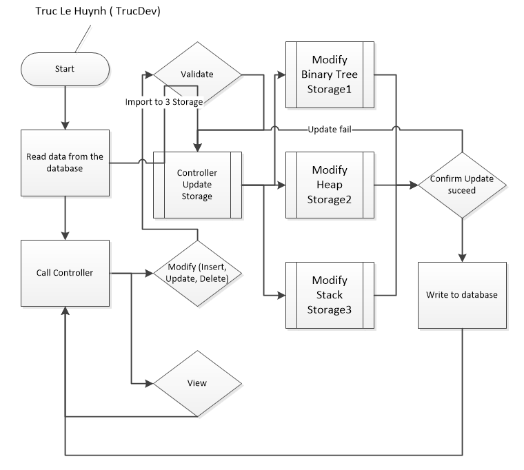

# Registration System

## Overview
The **Registration System** is a C++ group project that serves as a platform for student registration. This system simulates real-world registration processes while incorporating key concepts of data structure management. It is designed as an educational tool to provide data science students with practical experience in handling complex data structures.

---

---

## Key Features
- **Multiple Data Structures:** The system employs three distinct data structures to optimize storage and retrieval operations:
  - **Binary Search Tree (BST):** Efficient for ordered data and allows for quick searching, insertion, and deletion.
  - **Heap:** Ideal for prioritizing tasks, ensuring fast access to the smallest or largest element.
  - **Hash Table:** Offers near-constant time complexity for lookup operations, making it highly efficient for large datasets.

- **Control Manager:** A centralized control manager is responsible for handling key operations across all data structures, including:
  - **Insertions:** Adding new student records.
  - **Updates:** Modifying existing student details.
  - **Deletions:** Removing student records when necessary.

- **Helper Objects:** To ensure security, modularity, and code abstraction, the project utilizes several helper objects:
  - **File-Reader:** Facilitates secure and efficient reading of student data from external files.
  - **Student:** Represents each student as an object, encapsulating attributes like name, ID, and course details.
  - **Data:** An abstraction layer that manages interactions between the control manager and the data structures.

## Data Structure Use Case and Optimization
Each data structure is employed for specific purposes to ensure an optimized and reliable registration system. For example:
- **Binary Search Tree (BST):** Useful for ordered retrieval and fast searching of specific students by their ID.
- **Heap:** Provides efficient prioritization, such as for students with urgent registration needs.
- **Hash Table:** Ensures fast, constant-time searches for student records, making it suitable for handling large datasets.

This multi-data structure approach provides redundancy, serving as a backup system, while also allowing for an optimized search engine that tailors searches based on the requirements of the query.

## Educational Purpose
This project is designed for educational purposes and is intended for data science students to practice working with different data structures in C++. It is not optimized for production-level deployment, but rather aims to enhance students' understanding of:
- Managing complex data in different data structures.
- Abstracting data operations for modularity and security.
- Developing real-world problem-solving skills.

## Conclusion
The **Registration System** project combines the power of multiple data structures with a modular and secure design, making it an excellent learning tool for students interested in data science, data structures, and C++ programming. Through this project, students will gain hands-on experience with binary search trees, heaps, and hash tables while understanding the importance of efficient data management.

## Technology
- C++, Pointer, Encapsulation, Polymorphism, Data Structures
